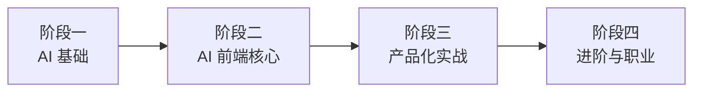

# 学习计划总览

## 你是谁

本计划假设你已具备：

- React 18+、Hooks、状态管理
- Next.js App Router（或愿意同步学习）
- TypeScript、Tailwind CSS
- REST API 与基础 Node.js

**不需要** 机器学习或深度学习背景，但需要对 LLM 工作原理有正确心智模型。

---

## 学习路线图



| 阶段 | 周次 | 主题 | 产出 |
|------|------|------|------|
| [一、AI 基础](./01-foundation.md) | 1–2 | LLM、Prompt、API | Prompt Lab + API 调用 Demo |
| [二、AI 前端核心](./02-frontend-core.md) | 3–6 | 流式 UI、SDK、状态 | 完整 Chat 应用 |
| [三、产品化实战](./03-production.md) | 7–9 | RAG UI、Agent、评估 | 可部署的 Copilot 项目 |
| [四、进阶与职业](./04-advanced.md) | 10+ | 性能、安全、面试 | 作品集 + 技术博客 |

---

## 每周学习节奏（建议）

| 天 | 活动 | 时间 |
|----|------|------|
| 周一–周二 | 阅读文档 + 官方教程 | 3–4h |
| 周三–周四 | 跟着做小 Demo | 4–6h |
| 周五 | 整合进周项目 | 3–4h |
| 周末 | 复盘、写笔记、扩展阅读 | 2–3h |

---

## 核心能力矩阵

```
                    低 ──────────────────────────► 高
前端工程            ████████████████████  (你已具备，持续深化)
LLM / API 理解      ░░░░████████████████
Prompt 工程         ░░░░░░██████████████
流式 / Chat UX      ░░░░░░░░████████████
RAG / 向量检索 UI   ░░░░░░░░░░██████████
Agent / Tools UI    ░░░░░░░░░░░░████████
可观测 / 评估       ░░░░░░░░░░░░░░██████
```

---

## 技术栈（本路径统一选用）

| 类别 | 选型 | 原因 |
|------|------|------|
| 框架 | Next.js 15 + App Router | AI SDK 一等公民、部署简单 |
| AI SDK | Vercel AI SDK (`ai`) | 流式、Tool、React Hooks 成熟 |
| 样式 | Tailwind CSS + shadcn/ui | 快速搭建 Chat UI |
| 类型 | TypeScript 严格模式 | 与 SDK 类型安全对接 |
| 部署 | Vercel | 与生态一致 |
| 可选后端 | Supabase / Pinecone | RAG 实战 |

---

## 学习原则

1. **先跑通，再优化** — 第一周就要能调通 API
2. **前端视角理解 AI** — 关注延迟、取消、错误、空状态，而非训练模型
3. **每个概念配一个 UI** — Prompt 变体对比器、Token 计数器、流式打字机
4. **记录失败案例** — 幻觉、截断、超时是日常，学会复现与展示
5. **作品集优先** — 每个阶段至少 1 个可演示项目

---

## 下一步

打开 [阶段一：AI 基础](./01-foundation.md)，从第 1 周任务开始。
